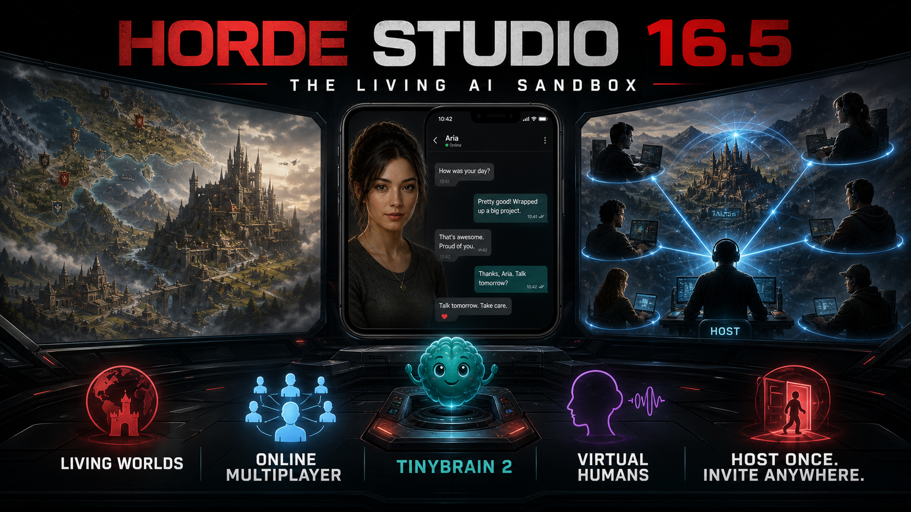

# Horde Studio 16.5.0

Horde Studio 16.5 turns collaborative AI roleplay into a first-class experience. One host supplies the world, canonical state and AI connection; everyone else joins the same living session without sharing API credentials.

## Online and LAN multiplayer

- A dedicated **Multiplayer** destination now serves both Chat Library rooms and Worlds.
- Host-authoritative sessions keep a single canonical timeline and make exactly one AI call per committed round.
- Every participant has an independent player identity and persona; gameplay no longer assumes one player.
- Round-robin turns, host controls, reconnecting guests and role-aware permissions are built into the session protocol.
- Rerolls and other history-changing actions require a party vote.
- LAN rooms remain available for private local play.
- Internet rooms use short `HS1…` invite codes and a small self-hosted WebSocket room server.
- The app includes a plain-language, five-minute Cloudflare setup guide with copyable commands. Guests only need the invite code.

## TinyBrain 2 and Pip

- TinyBrain 2 adds a more capable local cognition layer for routing, validation, tool-oriented background work and diagnostics.
- Pip has been rebuilt as a compact support conversation instead of a wall of dashboard cards.
- Pip searches its versioned Horde Studio handbook before answering product questions and keeps help retrieval private on the device.

## Worlds and creation reliability

- Region, building, room and transit containment is represented explicitly instead of overloading regions.
- Legacy-world migration and deeper health checks repair missing structure without discarding authored content.
- Built-in worlds are upgraded to the current hierarchy and travel model.
- World saves and person creation include stronger transactional guards against partial writes and accidental data loss.

## Virtual Humans and portable builds

- Advertised built-in Virtual Humans are embedded into the portable release rather than depending on fragile optional sidecar loading.
- Portable exports retain the media and authored social material needed by the human.
- The portable build now includes the Multiplayer client, Internet-room server source and setup documentation.

## Release notes

- Internet-room traffic contains gameplay text. Only join room servers you trust.
- The host's AI provider and model handle the shared generation request; guests never receive the host's API credentials.
