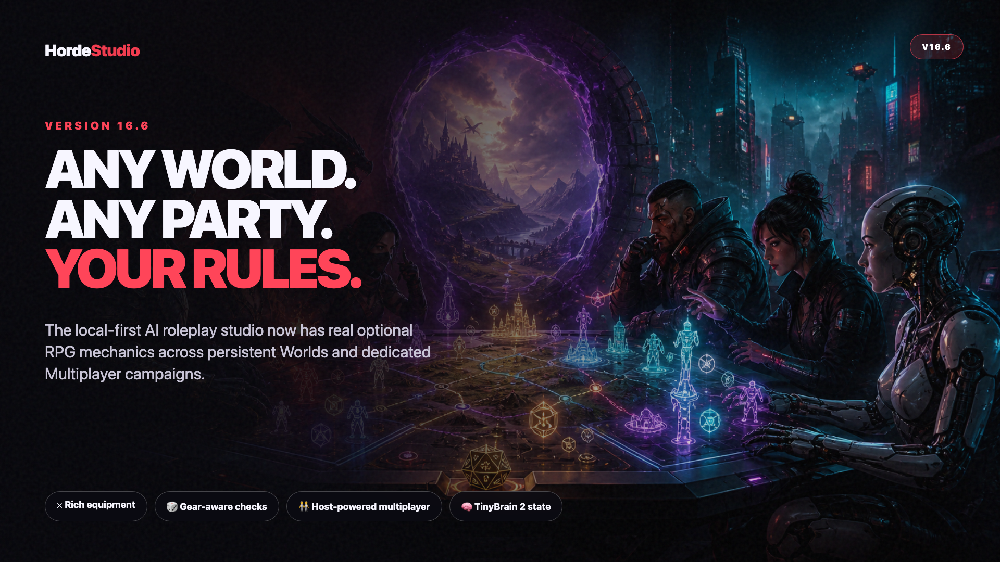

# Horde Studio 16.6.0

Horde Studio 16.6 turns its persistent Worlds and dedicated Multiplayer campaigns into complete, system-agnostic tabletop sandboxes. Mechanics are powerful when wanted and disappear cleanly when they are not.

## Optional RPG mechanics everywhere

- Choose **Off**, **Light** or **Full** mechanical depth in Multiplayer.
- Worlds can use Pure Narrative, Slice of Life, Mystery, Adventure or Full RPG profiles, then override individual modules.
- Toggle World mechanics during play without deleting stats, inventories or character builds.
- Turning mechanics off pauses checks, equipment bonuses, resources, effects and progression while preserving authored data.

## Rich items and equipment

- Create weapons, armor, clothing, consumables, tools, cyberware, treasure, quest items and custom objects.
- Define damage, damage type, armor, range, weight, value, rarity, charges, durability and requirements.
- Equipment can modify attributes, skills, defenses, resources, checks, damage and armor.
- Character sheets show base values and effective gear-adjusted values clearly.
- Legacy text inventories migrate safely into the richer item format.

## Checks, state and progression

- Equipped gear now contributes to validated World and Multiplayer checks.
- Full mode supports progression, requirements, buffs, debuffs and status effects.
- TinyBrain 2 can assist with structured state work while the host's selected model remains responsible for final narration.
- Host-authoritative Multiplayer keeps one canonical campaign state and synchronizes live rules changes with the party.

## Reliability and portability

- Worlds and Multiplayer use the same versioned mechanics module instead of maintaining incompatible copies.
- The portable builder now includes the shared RPG engine and Multiplayer engine explicitly.
- Release audits cover legacy migration, equipment bonuses, resource modifiers, mechanics pausing, UI wiring and ZIP contents.
- No existing save is destructively rewritten merely because mechanics are enabled or disabled.

## Choose your experience

Horde Studio still works as a pure narrative roleplay frontend. The new system is an opt-in layer for creators and parties who want character builds, equipment, dice and lasting mechanical consequences.
